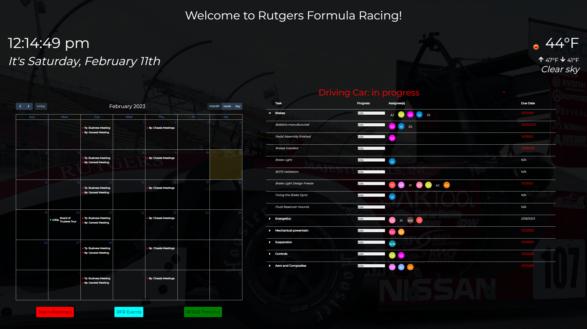

## In-house dashboard for Rutgers Formula Racing Team
Please do NOT use this code without explicit permission. You can request permission by contacting Matthew Vandenberg at msv77@scarletmail.rutgers.edu.

This serves as a dashboard to keep on the TV inside the Rutgers Formula Racing shop. It is a simple web app, composed of two componenets: the front-end webpage and the back-end server. 

The front-end webpage is composed of a React project. It utilizes OpenWeatherMap's API to display the weather, the Google Calendar API to display the team's calendar, and the makes requests to the backend API to be able to display the team's Clickup tasks. Options are given to the user which allows them to turn on/off/customize certain features such as Celcius/Fahrenheit, show seconds in time, etc.

The backend server is a Node.js server built with Express.js in Typescript that makes requests to the Clickup API to get the team's tasks. It then parses the data and sends it to the front-end for consumption.

Ultimately the long-term goal is to host this on a remote server. To prepare for that, the backend fetches Clickup tasks every ten seconds. Then, when a fetch request is made from the dashboard, the backend can simply return back the most recently fetched tasks.

> **For RFR Members:** To run, just run `bash run.sh` from within ***rfr-dashboard/src***. This is a simple script that should quickly get the server and front-end webpage running.

